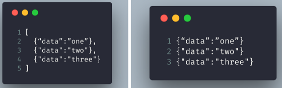

```{r setup, include=FALSE}
knitr::opts_chunk$set(echo = TRUE)
# https://hendrikvanb.gitlab.io/2018/07/nested_data-json_to_tibble/
# https://www.rdocumentation.org/packages/jsonlite/versions/1.7.2
# https://robotwealth.com/how-to-wrangle-json-data-in-r-with-jsonlite-purr-and-dplyr/
## https://themockup.blog/posts/2020-05-22-parsing-json-in-r-with-jsonlite/
# https://tidyr.tidyverse.org/articles/rectangle.html
# xaringan::inf_mr()
```

## Load necessary packages

```{r}
library(tidyverse)
library(jsonlite)
library(listviewer)
```

<br/>

# How do JSON strings look like anyways?

```{r}
# inspect existing files in folder "data/"
list.files("data/")

# print contents of the JSON file
cat(paste0(readLines("data/students_data.json", warn=FALSE), collapse="\n"))
```

<br/>

# Understanding how JSON files are read with `jsonlite`

First, let's load an exemplary JSON file with jsonlite's `fromJSON()` function ([documentation](https://www.rdocumentation.org/packages/jsonlite/versions/1.7.2/topics/toJSON,%20fromJSON))

```{r}
# load json file
json_data <- fromJSON("data/students_data.json")
json_data
```

<br/>

## Why the different data types? The answer is *simple*

<br/>

JSON data usually gets converted into **lists** when it is read by `fromJSON()`.

However, **this is not always the case**. Depending on how the JSON data is structured, `fromJSON()` automatically converts the array to other R classes.

This process where JSON arrays automatically get converted from a list into a more specific R class is called **simplification**.

There are **3 types** of JSON arrays that get converted to different R classes by default: 
* arrays of **primitives**
* arrays of **objects**
* arrays of **arrays**

*Hint: you can identify `arrays` through blockquotes `[]`.*

Let's take a closer look at these.

<br/>

### R `vectors` are created from JSON `arrays of primitives` (strings, numbers, booleans or null)

<br/>

The `teachers` element in the JSON file is an **array of primitives**. "Primitives" are either `strings`, `numbers`, `booleans` or `null` values (they are named so because they are the simplest elements available in a programming language).

> "teachers": ["Simon Munzer", "Lisa Oswald"]

Why? It has 
- `Primitives` i.e. strings separated by commas `,` 
- all within blockquotes `[]`

These get converted to a R `vector` by default. See again:

```{r}
json_data["teachers"] # output is a R vector
```


<br/>

### R `data frames` are created from JSON `arrays of objects` (key-value pairs)

<br/>

The `students` element in the JSON file is an **array of objects**.

> "students": [
        { 
            "id":"014789", 
            "name": "Francesco", 
            "lastname": "Danovi"
        }, 
        { 
            "id":"023657", 
            "name": "Gabriel", 
            "lastname": "da Silva Zech" 
        }
    ]

Why? It has 
- `Objects` i.e. key-value pairs separated by commas `,`
- within curly brackets `{}` that are also separated by commas `,`
- all within blockquotes `[]`. 

These get converted to a R `data frame` by default. See again:

```{r}
json_data["students"] # output is a R data frame
```

<br/>

### R `matrices` are created from JSON `arrays of arrays` (equal-length sub-arrays)

<br/>

The `ages_students_teachers` element in the JSON file is an **array of arrays**.

> "ages_students_teachers": [[23, 24],
                             [27, 33]]

Why? It has 
- `Arrays` i.e. numbers separated by commas `,` within blockquotes `[]`
- next to other **equal length** `arrays` separated by commas `,`
- all within blockquotes `[]`. 

These get converted to a R `matrix` by default. See again:

```{r}
json_data["ages_students_teachers"] # output is a R matrix
```

<br/>

## How and why to prevent automatic simplification

<br/>

It is possible, however, to disable this automatic simplification. This can be done by passing `simplifyVector = FALSE` to the `fromJSON()` function.

This will make sure all values are returned as **lists**.

```{r}
fromJSON('["Simon Munzer", "Lisa Oswald"]')
fromJSON('["Simon Munzer", "Lisa Oswald"]', simplifyVector = FALSE)

fromJSON('[{ "id":"023657", "name": "Gabriel", "lastname": "da Silva Zech" }]')
fromJSON('[{ "id":"023657", "name": "Gabriel", "lastname": "da Silva Zech" }]', simplifyVector = FALSE)

fromJSON('[[23, 24], [27, 33]]')
fromJSON('[[23, 24], [27, 33]]', simplifyVector = FALSE)
```

<br/>

Having all your data organised in lists instead of a mixture of lists, vectors, data frames and matrices is beneficial because it will allow you to **work more consistently** with a few number of helper functions.

Don't take my word for it. You can take Hadley Wickham's, the guy behind tidyverse - it has been [reported](https://themockup.blog/posts/2020-05-22-parsing-json-in-r-with-jsonlite/) that when he works with the jsonlite package, he prefers to read JSON files without simplifying them.

<br/>

## Reading newline-delimited JSON files

A slight variation of the JSON format is the [newline-delimited JSON (aka ndjson)](http://ndjson.org/) format. 

In this format, each line is a JSON element in itself. This allows one to read individual elements without having to parse the entire file, which is helpful in certain use cases such as reading log files.


JSON on the left, ndjson on the right (credit: [Jaga Santagostino](https://medium.com/@kandros/newline-delimited-json-is-awesome-8f6259ed4b4b))
 
This is important to know because `fromJSON()` will through the error `parse error: trailing garbage` when trying to read a ndjson file.
 
> # fromJSON("data/yelp_academic_dataset_business.json")
> Error in parse_con(txt, bigint_as_char) : parse error: trailing garbage: true}, "type": "business"} {"business_id": "UsFtqoBl7naz8A (right here) ------^

This is where the `stream_in()` function for reading ndjson comes in ([documentation](https://www.rdocumentation.org/packages/jsonlite/versions/1.7.2/topics/stream_in,%20stream_out)). Let's use it to read the a dataset containing information on businesses on the Yelp platform ([source](https://www.kaggle.com/yelp-dataset/yelp-dataset)).

```{r}
# read the first 500 lines of the ndjson file
yelp_list <- stream_in(textConnection(readLines("data/yelp_academic_dataset_business.json", n=500)), simplifyVector = FALSE)

# alternatively, the code below reads the entire file:
# yelp_list <- stream_in(file("data/yelp_academic_dataset_business.json"), simplifyVector = FALSE) 

# print the information for the first business
str(yelp_list[[1]])

```
<br/>

# Transforming JSON data into tidy data sets

<br/>

## The art of "rectangling"
 
```{r}
yelp_df <- tibble(businesses = yelp_list)
yelp_df %>% hoist(businesses, name = "name")
```

 
 ####################################################################################################################
 

```{r eval=FALSE, include=FALSE}
yelp_big <- stream_in(file("data/yelp_academic_dataset_business.json"))


str(yelp_big_f, max.level = 2)

# df_unsimple <- stream_in(file("data/yelp_academic_dataset_business.json"), simplifyVector = FALSE)

# df_u <- read_json("data/yelp_academic_dataset_business.json")

as_tibble(yelp_big)

str(yelp, max.level = 1)yelp_big %>%
  as_tibble() %>%
  # as.data.frame()
  #unnest_wider("hours")
  #.[c(name, hours, categories)]
  
  select(name, hours, categories) %>%
  unnest_longer(categories)
  #unnest(Tuesday, Monday) 


# df_s <- toJSON(df_s) DOESNT WORK

# write_json(yelp, "data/yelp_dataset.json")

df_new <- fromJSON("data/yelp_dataset.json", simplifyVector = FALSE)


test <- tibble(a = yelp_big_f)
test %>% hoist(a, name = "name")

%>% 
  unnest_longer()
names(yelp)

```

## Viewing JSON contents with `listviewer`

<br/>

```{r eval=FALSE, include=FALSE}
listviewer::jsonedit(yelp_big_f, height = "800px", mode = "view")

```

<br/>

## Nested data frames

First, let's take a look at the first level of the yelp data.

```{r include=FALSE}
#str(yelp, max.level = 1)

```


Here we can see that the ``hours`` element is a data frame, and upon inspection of that element, we see that there are another level of data frames within the ``hours`` element.


```{r include=FALSE}
#str(yelp$hours, max.level = 1)
```

Since we are here dealing with data frames within dataframes, we call these **nested data frames**.

<br/>

```{r include=FALSE}
# yelp %>% 
#   # equivalent to raw_json[["athletes"]][["athlete"]]
#   # purrr::pluck("athletes", "athlete") %>% 
#   # glimpse()
#   select(name, hours) %>% 
#   # flatten()
#   unnest_longer(hours)
```
